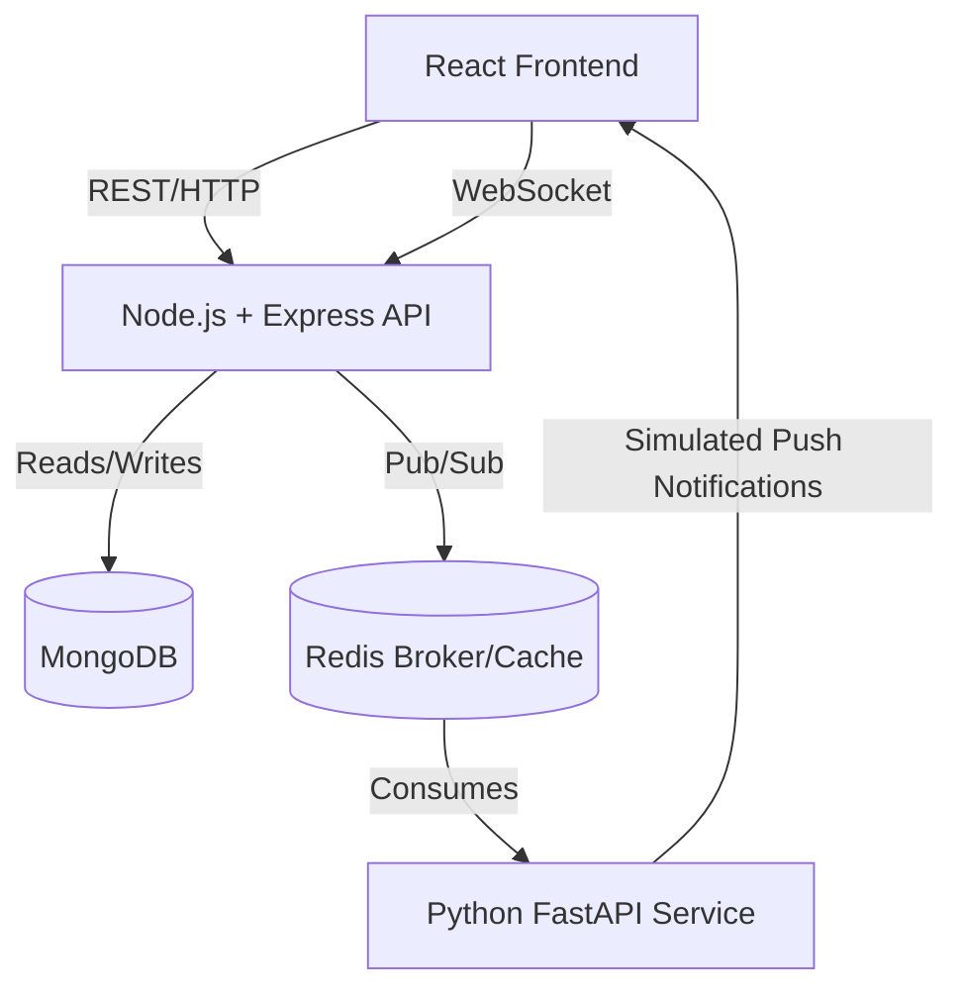

# Real-Time Chat System

A scalable real-time chat application similar to WhatsApp or Messenger.

## Features
- **Real-Time Messaging**: Instant message delivery using Socket.IO.
- **Group Chats**: Create group conversations with multiple participants.
- **Typing Indicators**: See when the other person is typing in real-time.
- **Read Receipts**: Visual indicators for sent (✓) and seen (✓✓) statuses.
- **Online Presence**: Real-time online/offline status tracking.
- **Scalable Architecture**: Node.js backend with Redis for pub/sub scaling and caching.
- **Python Microservice**: Dedicated notification and analytics service.
- **Premium UI**: Modern dark mode with glassmorphism and smooth animations.

## Tech Stack
- **Frontend**: React.js, Vite, Axios, Socket.IO Client
- **Backend Primary**: Node.js, Express, Socket.IO, JWT Auth, Mongoose
- **Backend Service**: Python, FastAPI, Redis Asyncio
- **Infrastructure**: MongoDB, Redis, Docker Compose

## Installation & Setup

1. Make sure you have Docker and Docker Compose installed.
2. Clone the repository and navigate to the project directory.
3. Start the entire infrastructure using Docker Compose:
   ```bash
   docker-compose up --build
   ```
4. Access the frontend at: `http://localhost:5173`
5. The backend API runs on `http://localhost:5000`
6. The Python service runs internally on port `8000`.

## Architecture Diagram

